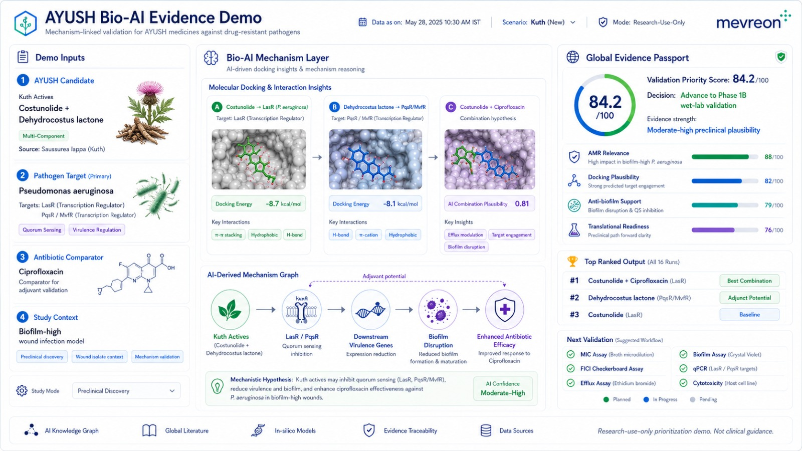

# Mevreon Bio-AI Platform

> **Enterprise-grade biophysical drug-discovery workbench** screening Ayush phytochemical compounds against multi-drug resistant pathogenic targets using AutoDock Vina (physics-based ΔG) and DiffDock-L (generative AI diffusion).

---

## 🚀 Quick Start — One-Click Cloud Deployment

**Get the full platform running on your own Google Cloud in under 5 minutes.**

### Prerequisites
- [Google Cloud SDK](https://cloud.google.com/sdk/docs/install) installed
- A GCP project with billing enabled
- That's it — no Docker, Node.js, or Python needed on your machine

### Deploy

**On Mac / Linux / Git Bash:**
```bash
# 1. Clone this repository
git clone https://github.com/mevreonai/Ayush-Demo.git
cd Ayush-Demo

# 2. Authenticate with Google Cloud (if not already)
gcloud auth login
gcloud config set project YOUR_PROJECT_ID

# 3. Deploy — one command
bash deploy.sh
```

**On Windows (PowerShell):**
```powershell
# 1. Clone this repository
git clone https://github.com/mevreonai/Ayush-Demo.git
cd Ayush-Demo

# 2. Authenticate with Google Cloud (if not already)
gcloud auth login
gcloud config set project YOUR_PROJECT_ID

# 3. Deploy — one command
.\deploy.ps1
```

Within ~5 minutes you'll receive a live HTTPS URL. Open it to explore:
- **12 pathogenic target proteins** across 3 drug-resistant organisms
- **24 Ayush phytochemical compounds** screened per target (288 docking pairs)
- AutoDock Vina binding affinities and DiffDock-L confidence scores
- Interactive 3D molecular structure viewers (WebGL)
- Evidence Passports with validation priority scores
- Mechanism of Action cascade graphs
- Downloadable screening leaderboards (CSV)

> **Cost:** The platform scales to zero when idle — effectively $0/month. To remove: `gcloud run services delete ayush-bioai-demo --region us-central1`

---




## Architecture Overview

The platform is strictly decoupled into two high-availability zones:
1. **Frontend (Serverless):** A React 19 + TypeScript SPA built with Vite. It requires **zero backend compute** during runtime, loading massive 3D structures, SVG interaction networks, and metrics directly from the pre-computed `dist` folder.
2. **Backend (GCP GPU VM):** A Python-based automation pipeline running on Google Cloud Platform. It autonomously prepares targets, calculates 3D interaction affinities, and synchronizes the results directly to a GCS Cloud Storage Bucket.

---

## Google Cloud Platform (GCP) End-to-End Setup Guide

To run the computational pipeline and generate 100% genuine molecular coordinates, you need an NVIDIA GPU on GCP.

### 1. Prerequisites & GCP Services

Before deploying the VM, ensure you have enabled the following services in your GCP Console:
*   **Compute Engine API**
*   **Cloud Storage API**
*   **Identity and Access Management (IAM) API**

You must also grant your default Compute Engine Service Account the **`Storage Object Admin`** role on your bucket to allow automated synchronization:
```bash
gcloud storage buckets add-iam-policy-binding gs://YOUR_BUCKET_NAME \
    --member="serviceAccount:YOUR_PROJECT_NUMBER-compute@developer.gserviceaccount.com" \
    --role="roles/storage.objectAdmin"
```

### 2. VM Creation (NVIDIA L4 GPU)

We utilize the `g2-standard-8` instance with an NVIDIA L4 GPU. We also use Google's official Deep Learning VM image to avoid manual NVIDIA driver installations.

Run this command in your local `gcloud` terminal:

```bash
gcloud compute instances create uc4-model-vm \
    --project=YOUR_PROJECT_ID \
    --zone=asia-southeast1-b \
    --machine-type=g2-standard-8 \
    --accelerator=count=1,type=nvidia-l4 \
    --image-family=common-cu121-debian-11 \
    --image-project=deeplearning-platform-release \
    --maintenance-policy=TERMINATE \
    --scopes=https://www.googleapis.com/auth/cloud-platform
```
*(Note: If you receive a `ZONE_RESOURCE_POOL_EXHAUSTED` error, you must wait for hardware availability or change zones).*

### 3. Automated VM Environment Setup

Once the VM is running, SSH into it and run our automated `setup.sh` script. This script handles the OS updates, Conda installation, PyTorch CUDA mapping, and pulls the codebase.

```bash
gcloud compute ssh uc4-model-vm --zone=asia-southeast1-b --tunnel-through-iap

# Inside the VM:
curl -O https://raw.githubusercontent.com/mevreonai/Ayush-Demo/main/setup.sh
chmod +x setup.sh
./setup.sh
```

### 4. Running the High-Throughput Pipeline

The platform is designed for zero-touch automation. Once `setup.sh` completes, you can execute the pipeline.

**Single Target Run:**
```bash
cd /opt/services
/opt/services/uc4_env/bin/python scripts/screen_all_ligands_structured.py --target pqsr
```

**Full 12-Target Automated Campaign:**
```bash
cd /opt/services
nohup ./scripts/run_all_remaining.sh > campaign.log 2>&1 &
```
*This will run all remaining targets and automatically upload them to your GCS bucket.*

---

## Launching the User Interface

The React frontend is designed to be hosted statically on Vercel, Netlify, or local static servers.

### Local Development

1. Ensure you have Node.js 18+ installed.
2. Navigate to the `frontend/` directory.
3. Install dependencies and start the Vite development server:
```bash
cd frontend
npm install
npm run dev
```

### Production Deployment (Vercel)

To deploy the production-ready dashboard to the web with 0ms latency:

1. Copy the output datasets from your GCS bucket into the React assets folder:
```bash
gcloud storage cp -r gs://YOUR_BUCKET_NAME/* frontend/public/outputs/
```
2. Compile the optimized distribution:
```bash
cd frontend
npm run build
```
3. Drag and drop the `frontend/dist/` folder directly into [Vercel](https://vercel.com) or [Netlify](https://netlify.com). No complex routing or backend configuration is required!

---

### Core Target Pathogens Integrated
*   **Pseudomonas aeruginosa**: LasR, PelD, PqsR, MexB
*   **Staphylococcus aureus**: AgrA, SrtA, MecA
*   **Enterobacteriaceae**: AcrB, MurJ, OmpK36, MrkH, Wzc
