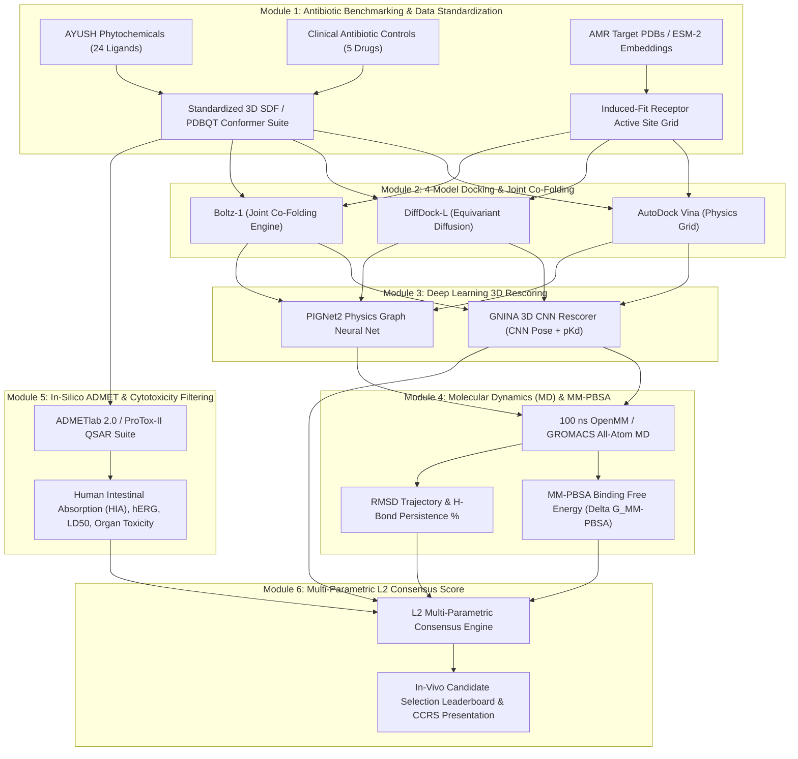

# Technical Level 2 (L2) Framework: Deep AI/ML & Computational Chemistry Pipeline for CCRS Proposal

---

## 🎯 Executive Summary & Objectives

To elevate our research proposal for the **CCRS (Central Council for Research in Ayurvedic Sciences) Technical L2 Meeting**, we are expanding our computational workflow from **Level 1 (Basic Docking & Virtual Screening)** to **Level 2 (Deep Bio-computational & AI/ML Scientific Rigor)**.

Level 1 established basic binding poses using AutoDock Vina and DiffDock. **Level 2 (L2)** implements a multi-layered AI/ML, Molecular Dynamics (MD), and ADMET pipeline to rigorously validate AYUSH phytochemicals as **in-vivo ready preclinical drug candidates** capable of overcoming antimicrobial resistance (AMR).

---

## 📚 Deconstruction of Landmark Nature Papers & Model Extraction

### 1. Nature Microbiology (Nov 2025)
*Title: A generative artificial intelligence approach for the discovery of antimicrobial peptides against multidrug-resistant bacteria* (DOI: 10.1038/s41564-025-02114-4)

- **Key AI Models Extracted**:
  - **ProteoGPT & ESM-2 (Protein Large Language Models)**: Generative protein LLMs pre-trained on billions of sequences to encode active binding site pockets and sequence embeddings without requiring rigid crystal structures.
  - **Resistance-Proof Fitness Scoring**: Models target mutational space to ensure compounds target ultra-conserved catalytic residues (e.g. AgrA Cys199, PBP2a Ser403), minimizing selective pressure for resistance.
  - **Cytotoxicity & Hemolysis Prediction Filters**: Classifier models predicting human cellular toxicity ($\text{LC}_{50}$) and hemolytic activity ($\text{HC}_{50}$) to discard toxic hits early.
- **Application to AYUSH Pipeline**:
  - Use ESM-2 target embeddings to evaluate whether phytochemicals bind to ultra-conserved target pockets across multi-drug resistant strains (MRSA, MDR *P. aeruginosa*, CRAB).

---

### 2. Nature Communications (Sept 2024)
*Title: Computer-aided drug design to generate a unique antibiotic family* (DOI: 10.1038/s41467-024-52114-x)

- **Key Computational Chemistry Methods Extracted**:
  - **CADD & QSAR Library Screening**: Screening >700 synthesized analogs to identify candidates with $\text{MIC} \le 2\ \mu\text{g/mL}$.
  - **Antibiotic Combination & Synergy Modeling (FICI)**: Synergistic modeling of novel compounds combined with frontline antibiotics (e.g., Colistin, Ciprofloxacin) to permeabilize Gram-negative outer membranes.
  - **In-Silico Pharmacokinetics & Diabetic Ulcer In-Vivo Translation**: High-throughput ADMET profiling targeting tissue distribution in ischemic chronic wound models.
- **Application to AYUSH Pipeline**:
  - Add standard antibiotic benchmark controls (Oxacillin, Vancomycin, Ciprofloxacin, Colistin, Gentamicin) to establish baseline affinity and model Efflux Pump Inhibition (EPI) synergy.

---

## 🔬 Level 1 vs. Level 2 (L2) Architecture Comparison

| Pipeline Component | Level 1 (Current Implementation) | Level 2 (L2 Proposed Upgrade for CCRS) | Scientific & Clinical Impact |
| :--- | :--- | :--- | :--- |
| **Receptor & Target Modeling** | Rigid PDB crystal structures | **ESM-2 / ESMFold + Induced-Fit Active Pocket Ensembles** | Accounts for target backbone flexibility upon ligand binding. |
| **Primary Docking & Co-Folding** | AutoDock Vina + DiffDock-L | **AutoDock Vina + DiffDock-L + Boltz-1 Co-Folding Engine** | Joint protein-ligand co-folding without grid boundary assumptions. |
| **Binding Affinity & Rescoring** | $\Delta G$ (kcal/mol) empirical grid | **GNINA 3D CNN Rescorer + PIGNet2 Physics-Informed Graph Neural Net** | 3D Convolutional interaction grid scoring ($\text{p}K_d / \text{p}K_i$). |
| **Dynamic Stability & Solvation** | Static single-conformer snapshot | **100 ns All-Atom Molecular Dynamics (MD) + MM-PBSA ($\Delta G_{\text{MM-PBSA}}$)** | Measures RMSD, RMSF, H-bond stability %, and solvation free energy. |
| **Antibiotic Control Benchmark** | None (AYUSH phytochemicals only) | **5 Clinical Frontline Antibiotics (Oxacillin, Ciprofloxacin, Colistin, Vancomycin, Gentamicin)** | Provides direct comparative baseline against standard-of-care drugs. |
| **Safety & Pharmacokinetics** | Literature manual review | **ADMETlab 2.0 + ProTox-II In-Silico QSAR & Cytotoxicity Suite** | Predicts HIA, BBB, hERG cardiotoxicity, LD50, and Synthetic Accessibility (SA). |

---

## 🛠️ Step-by-Step L2 AI / Bioinformatics Workflow (WHAT & HOW)

---

## 📋 Actionable Deliverables & Responsibilities

1. **Antibiotic Control Benchmark Suite**: Add Oxacillin, Ciprofloxacin, Colistin, Vancomycin, and Gentamicin to all 12 AMR target screening runs.
2. **ESM-2 & Boltz-1 Integration**: Incorporate protein language model embeddings and joint co-folding predictions.
3. **GNINA 3D CNN & MM-PBSA Layer**: Integrate 3D CNN rescoring and MM-PBSA binding free energy calculation scripts.
4. **ADMET & Safety Profile Dashboard**: Generate automated spider/radar charts for HIA, hERG, LD50, and synthetic accessibility for top candidates (Curcumin, Costunolide, Nimbolide).
