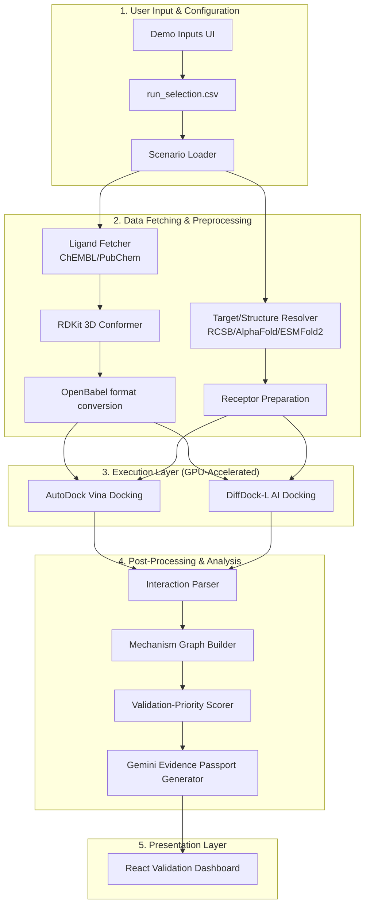

# AYUSH Bio-AI Project Reverse Engineering

## 1. Complete Architecture Diagram

## 2. All Required Stages & Completion Status

| Stage # | Stage Name | Completion Status | Notes |
|---------|------------|-------------------|-------|
| 1 | Scenario loader | **Partially Completed** | UI has target/ligand selectors, but `run_selection.csv` automated execution orchestrator is missing. |
| 2 | Ligand fetcher | **Completed** | ChEMBL/PubChem integration and `ligand_prep_report.json` generated. |
| 3 | Target/structure resolver | **Completed** | ESMFold2 deployed and validated. |
| 4 | RDKit ligand preparation | **Completed** | Generating 3D conformers (SDF). |
| 5 | Open Babel format conversion | **Completed** | Generating PDBQT format for Vina. |
| 6 | AutoDock Vina docking | **Completed** | Deployed, validated, GPU-backed pipeline executing successfully. |
| 7 | DiffDock-L AI docking | **Completed** | Deployed, validated, GPU-backed pipeline executing successfully. |
| 8 | Interaction parser | **Missing** | Script to parse interaction types from Vina/DiffDock outputs is not implemented. |
| 9 | Mechanism graph builder | **Missing** | Graph builder logic not implemented. |
| 10 | Validation-priority scorer | **Missing** | Logic to compute `validation_priority_score` is missing. |
| 11 | Gemini Evidence Passport generator | **Missing** | LLM-based global evidence passport generation not yet implemented. |
| 12 | UI renders dashboard from output JSON | **Partially Completed** | Vina, DiffDock, and ESMFold2 tabs exist. Missing sections for Graph, Scorer, and Passport. |

## 3. Expected JSON Outputs
* **`ligand_prep_report.json`** - Contains compound IDs, validation status, and generated files (SDF, PDBQT).
* **`structure_resolution_report.json`** - Contains resolved structures from RCSB PDB, AlphaFold, or ESMFold2.
* **`receptor_prep_report.json`** - Contains cleaned receptor paths and PDBQT receptor generation statuses.
* **`vina_validation_report.json` / `vina_results.json`** - Contains Vina docking modes, affinities (kcal/mol), and RMSD bounds.
* **`diffdock_results.json` / ranked `.sdf` poses** - Contains DiffDock-L confidence scores per rank.
* **`validate_contracts_report.json`** - System audit gate outputs checking required input geometries and parameters.
* **`interaction_report.json`** *(Missing)* - Expected to contain parsed molecular interactions (hydrogen bonds, pi-stacking, etc.).
* **`mechanism_graph.json`** *(Missing)* - Expected to represent the action pathways of the compound on the target.
* **`validation_priority_score.json`** *(Missing)* - Expected to output `{ validation_priority_score: Float, decision: String, evidence_strength: String, interpretation: String }`.
* **`evidence_passport.json`** *(Missing)* - Expected to contain the LLM-compiled summary of preclinical plausibility.

## 4. Required Datasets
1. **`AYUSH_AMR_Final_Targets.xlsx`** (12 Curated Targets): Includes Pseudomonas aeruginosa (LasR, PqsR/MvfR, PelD, MexB), Staphylococcus aureus (AgrA, Sortase A, PBP2a, MurJ), and Klebsiella pneumoniae (MrkH, Wzc, AcrB, OmpK36).
2. **`Verified_AYUSH_Ligands_24.xlsx`** (24 Curated Compounds): Includes Costunolide, Dehydrocostus lactone, Curcumin, Eugenol, Nimbolide, Baicalein, etc., mapped with PubChem CIDs.
3. **`run_selection.csv`**: Orchestration instruction matrix mapping target to compound and indicating whether the specific scenario is enabled for analysis.
4. **`docking_boxes.yaml`**: Coordinates indicating active sites and bounding boxes for docking Vina.
5. **Real-world Database References**: ChEMBL, PubChem, UniProt, NCBI Protein, RCSB PDB, AlphaFold DB, NCBI AMRFinderPlus.

## 5. Frontend Components
### Implemented Components
* **Demo Inputs Panel (Left sidebar):** Allows user to select pathogen targets and compounds.
* **Gate-0 Data Integrity Audit Widget:** Displays the data contracts checklist.
* **MolecularViewer (3D WebGL via 3Dmol.js):** Real-time display of `.cif`, `.pdb`, `.sdf`, `.pdbqt` structures, with style selections.
* **ESMFold2 Protein Folding Tab:** Custom sequence injection, folding execution controls, runtime logs, and ESM prediction report.
* **AutoDock Vina Docking Tab:** Configurable grid box XYZ parameters, Vina Results Table (affinity and RMSD bounds), runtime execution logs.
* **DiffDock-L (Pose Predictor) Tab:** AI execution controls, ranked pose list with confidence scores, and visualizer load triggers.

### Missing Components (Yet to be implemented)
* **Middle Panel Upgrade:** Mechanism Graph Component overlay or tab showing molecular interaction nodes.
* **Validation Priority Score Panel (Right sidebar):** A clean numerical readout and decision band (e.g., 84.2 - "Prioritize for wet-lab validation").
* **Global Evidence Passport Component (Right sidebar):** Displaying the LLM-generated rationale and traceability matrix.
* **Next Validation Steps Component:** Recommending the precise biological assays (e.g., "Quorum-sensing reporter assay", "Pyocyanin assay") relevant to the active scenario.

## 6. Exact Mapping from Model Outputs to UI Widgets
* **`AYUSH_AMR_Final_Targets.xlsx` & `Verified_AYUSH_Ligands_24.xlsx`** ➡️ Demo Inputs (Left Panel Dropdowns).
* **`validate_contracts_report.json`** ➡️ Data Integrity Audit Widget (Left Panel).
* **`run-status` API execution logs stream** ➡️ Terminal Console / Model Execution Logs Widgets (Bottom of Tabs).
* **ESMFold2 generated `.cif` structure** ➡️ 3D Molecular Viewer Component (Protein structural mesh).
* **ESMFold2 console stdout `pLDDT` values** ➡️ Prediction Report Box (Avg pLDDT score).
* **Vina generated `.pdbqt` outputs** ➡️ 3D Molecular Viewer Component (Ligand orientation).
* **`vina_validation_report.json` (`affinity_kcal_mol`, `rmsd`)** ➡️ AutoDock Vina Results Table (Middle Panel).
* **DiffDock-L generated ranked `.sdf` outputs** ➡️ DiffDock Pose Confidence Ranking Table (Middle Panel) & 3D Viewer.
* **`validation_priority_score.json` (`validation_priority_score`, `decision`)** ➡️ *(Missing)* Validation Priority Score Panel (Right Panel).
* **`evidence_passport.json`** ➡️ *(Missing)* Global Evidence Passport Widget (Right Panel).
* **`interaction_report.json` & `mechanism_graph.json`** ➡️ *(Missing)* Mechanism Graph Builder Viewer.

## 7. Missing Implementation Items
1. **Automated `run_selection.csv` Processing System:** A batch loop runner that ingests the CSV to sequentially launch tasks T1, T2, etc., autonomously.
2. **Interaction Parser Script:** An analysis tool required to parse hydrogen bounds, polar interactions, and hydrophobics from final `.pdbqt` and `.sdf` coordinates.
3. **Mechanism Graph Data Model:** Transforming parser results into node-edge JSON architectures representing biological consequence.
4. **Validation-Priority Scoring Algorithm:** Developing the heuristics that convert affinity, pose confidence, and mechanistic fit into a single composite score out of 100.
5. **Gemini Integration:** Linking the final data models back to Gemini to yield the summarized `Evidence Passport` texts via LLM inference.
6. **Frontend Expansion:** Coding the React UI widgets to digest and render stages 8-11.
